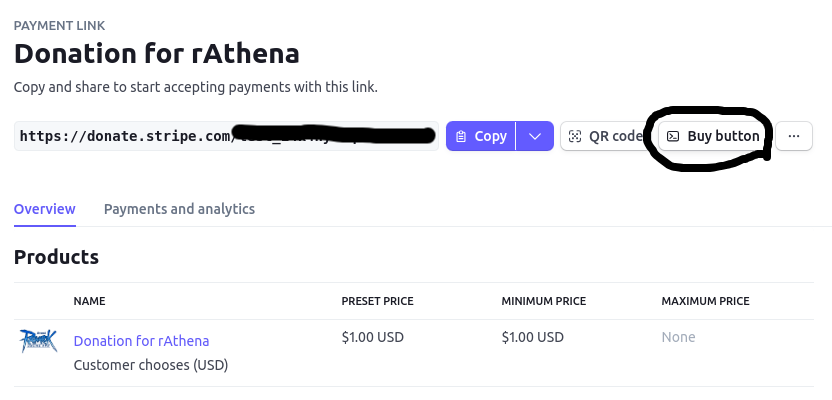
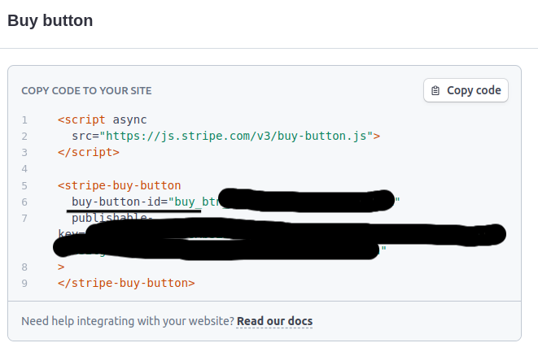
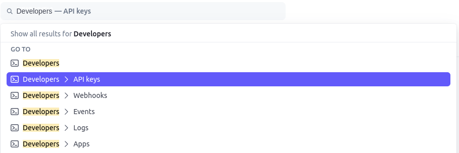
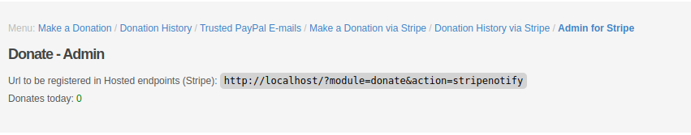
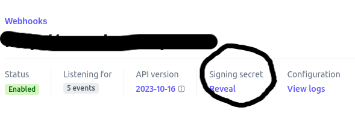

# Donate via Stripe (FluxCP)
This FluxCP addon enables donations via Stripe, it was built under the `donate` module, and you can customize it if you wish.

## How to Install
- Make sure to have [FluxCP](https://github.com/rathena/FluxCP) installed and running.
- [Extract](https://github.com/AraanBranco/fluxcp-donate-stripe/archive/refs/heads/main.zip) the project into the `/addons` folder.
- Create the tables in the database that are in the `/schemas` folder.
- Adjust the configurations, and your Stripe button will be working!

## Configuration you Stripe page
- Create one [Payment Link](https://support.stripe.com/questions/how-to-accept-donations-through-stripe) and make you custom configuration for you link.
- After get the button id:

- Add this ID config `/config/addons.php` in `StripeButtonId`
- Create secret key and publishable key, you get in ApiKeys section.

- Add the Secret Key and Publishable Key in config: `StripeSecretKey` and `StripePublishableKey`

## Configure Stripe Webhooks
- In Developers dashboard go to webhook tab and add new endpoint
- In *Endpoint URL* add url for receive the events of payments, you can get this url in menu `Admin for Stripe` in you FluxCP.

- In listen to select `Events on you account` and select the following events: `payment_intent.created`, `charge.succeeded`, `payment_intent.succeeded`, `payment_intent.payment_failed`, `checkout.session.completed`.

- After register the webhook url get the webhook secret and add in config `StripeWebhookSecret`
- And Done!

## Contribute
If you find a bug, please contact me or open one Issue/PR.
Feel free to contribute to the evolution of the code and if you use it, keep the credits!

### My contacts
Github: http://github.com/AraanBranco
Email: araanbranco@protonmail.com
rAthena: [Morphz](https://rathena.org/board/profile/99218-morphz/)

## Support Me
If you liked my work and want to help me in some way, buy me a coffee =)
Not only do you help me, but you also motivate me to continue with my work!

